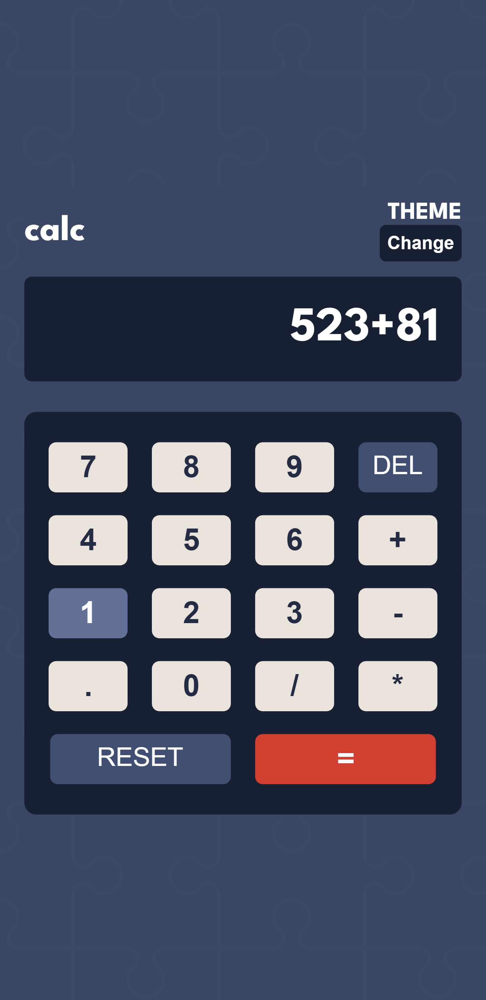
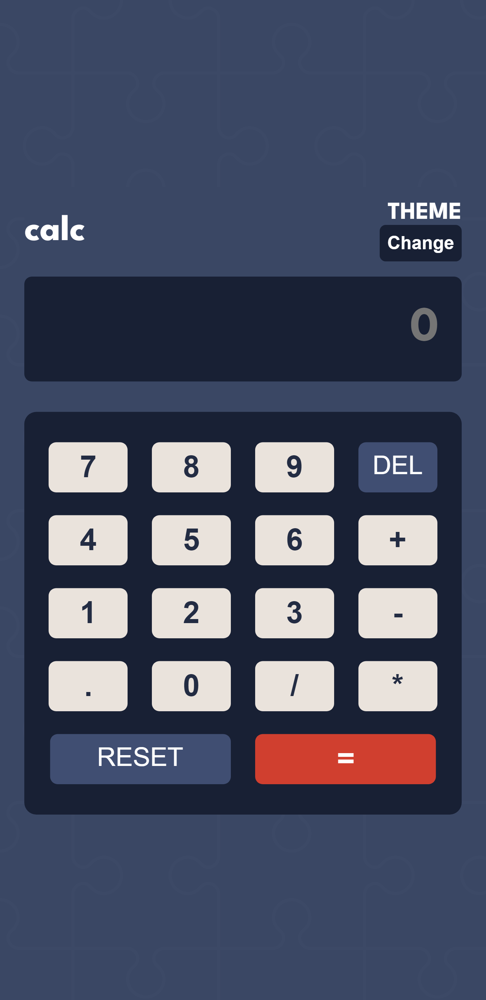
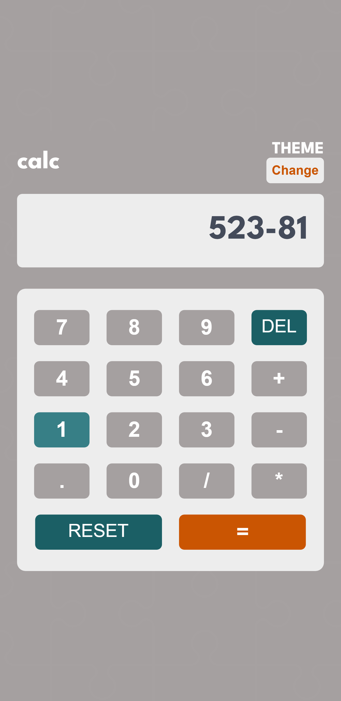
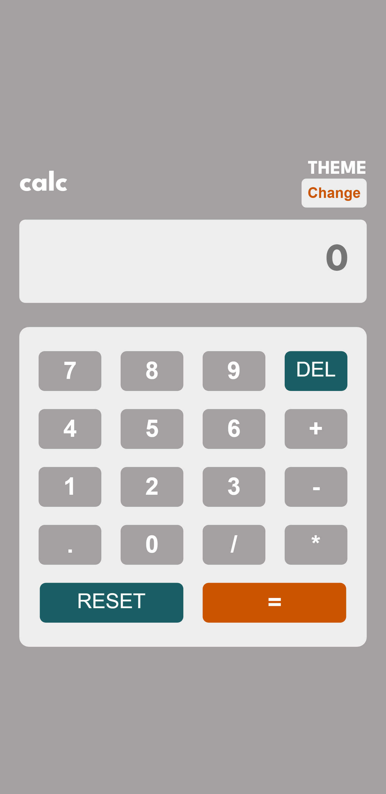

# Frontend Mentor - Calculator app solution

This is a solution to the [Calculator app challenge on Frontend Mentor](https://www.frontendmentor.io/challenges/calculator-app-9lteq5N29). Frontend Mentor challenges help you improve your coding skills by building realistic projects. 

## Table of contents

- [Overview](#overview)
  - [The challenge](#the-challenge)
  - [Screenshot](#screenshot)
  - [Links](#links)
- [My process](#my-process)
  - [Built with](#built-with)
  - [Useful resources](#useful-resources)
- [Author](#author)

## Overview

### The challenge

Users should be able to:

- See the size of the elements adjust based on their device's screen size
- Perform mathematical operations like addition, subtraction, multiplication, and division
- Adjust the color theme based on their preference

### Links

- Solution URL: [github repository](https://github.com/Joesef127/mini-calculator/))
- Live Site URL: [live demo](https://hivecalc.netlify.app)

## My process

### Built with

- Semantic HTML5 markup
- CSS custom properties
- Flex
- Mobile-first workflow
- javascript

### Useful resources

- [stackoverflow](https://www.stackoverflow.com) - This helped me on getting the operators to work and having the results displayed too. I really liked the method and will use it going forward.
- [medium](https://medium.com/@haxzie/dark-and-light-theme-switcher-using-css-variables-and-pure-javascript-zocada-dd0059d72fa2) - This is an amazing article which helped me finally understand how to change themes using javascript. I'd recommend it to anyone still learning this concept.

## Author

- Website - [joesef127](https://www.github.com/joesef127)
- Frontend Mentor - [@joesef127](https://www.frontendmentor.io/profile/joesef127)
- Twitter - [@merlinhive](https://www.twitter.com/merlinhive)

### Screenshot

